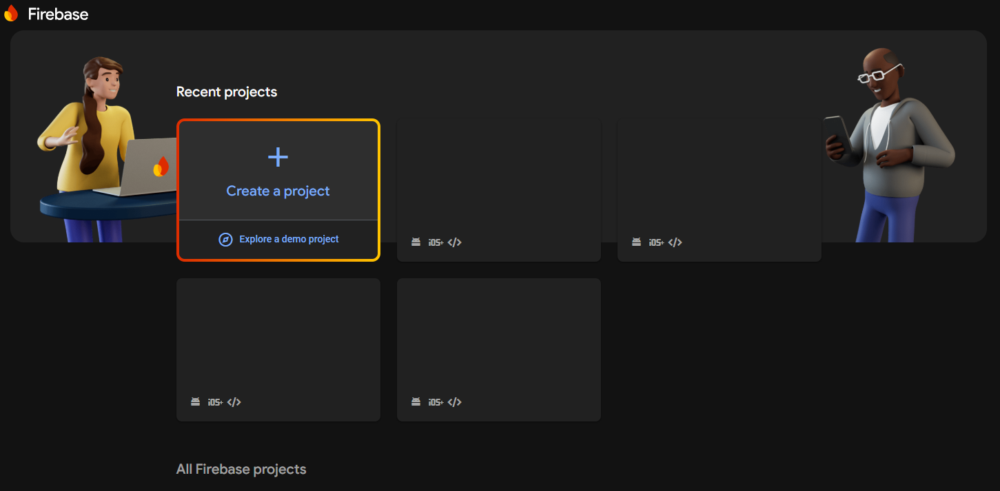
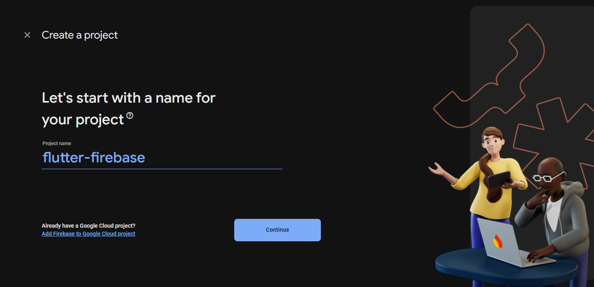
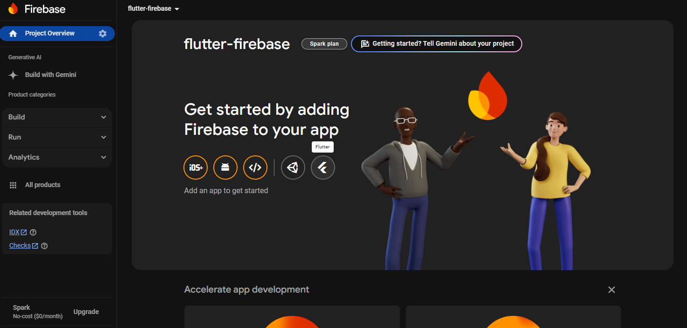
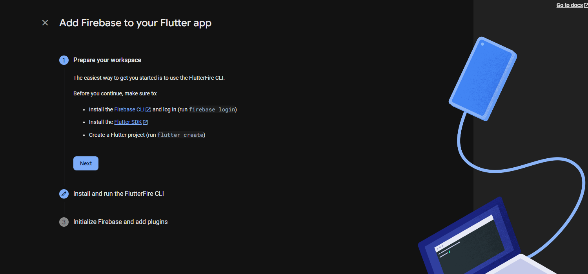
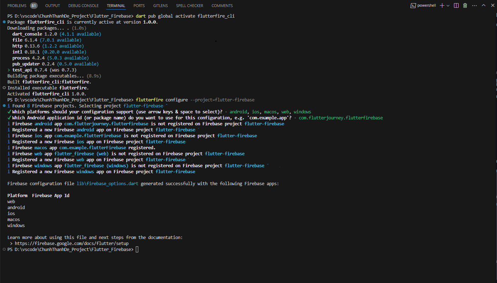
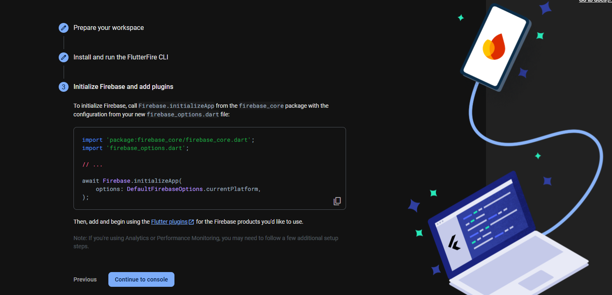
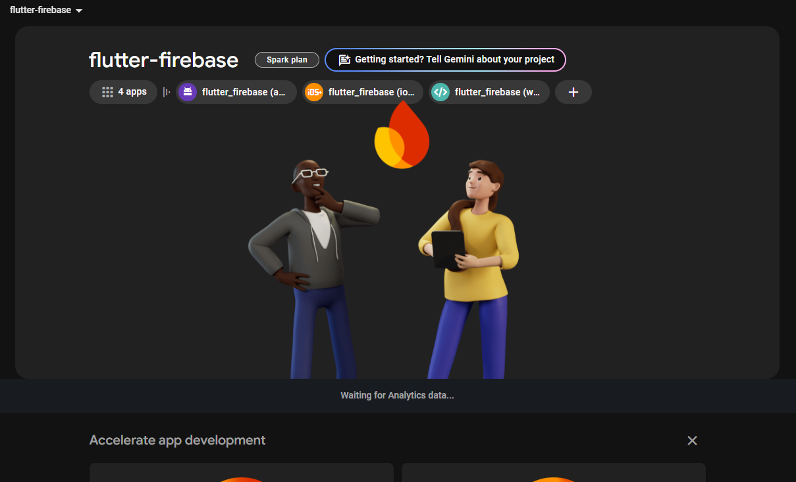

# Flutter_Firebase Setup Guide

This guide will help you set up your **Flutter** project with **Firebase** for the first time. Follow the steps below to get started:

### Step 1: Create Project in VSCode and Set up Firebase Console

1. **Create a new Flutter project in VSCode**:
   - Open VSCode and create a new Flutter project by running the following command in the terminal:
     ```bash
     flutter create flutter_firebase_project
     ```

2. **Set up Firebase Console**:
   - Go to the [Firebase Console](https://console.firebase.google.com/).
   - Create a new Firebase project in the console.

   

### Step 2: Set Project Name in Firebase Console

- After creating the project in the Firebase Console, make sure to set the project name according to your desired naming convention.

   

### Step 3: Choose Default Account

- In the Firebase Console, choose your **default account** for Firebase services.

   

### Step 4: Select Flutter in "Get Started by Adding Firebase to Your App"

1. In the Firebase Console, navigate to the **"Get Started by Adding Firebase to Your App"** section.

2. Select **Flutter** as your development platform.

   

### Step 5: Follow Firebase Console's Flow Guide Step by Step

- Firebase provides a step-by-step guide to configure Firebase with your Flutter app. Follow these steps carefully to ensure proper setup.

- **Important**: Firebase recommends using **npm** to install the Firebase CLI to help with configuration.

1. **Install Firebase CLI**:

- Open your terminal in VSCode and run the following command to install Firebase CLI globally:

     ```bash
     npm install -g firebase-tools
     ```

- The Firebase CLI will help you manage and deploy Firebase services.

    

2. **Connect Firebase to Your Flutter Project**:

- In the Firebase Console, follow the instructions to add Firebase to your Flutter project.

- You will be provided with a configuration file (google-services.json for Android, GoogleService-Info.plist for iOS), rest assured if you follow the instructions correctly, those files will be automatically added to your project add to your project.

    

3. **Modify `main.dart` to Initialize Firebase**:

- In your Flutter project, modify the `main.dart` file to initialize Firebase. Add the following code at the beginning of your `main.dart`

- This code ensures that Firebase is initialized before your app starts running.

    

### Step 6: Success!

- After completing the setup, you will see a confirmation screen indicating that Firebase has been successfully integrated into your Flutter project.

   

---

Now you are ready to start using Firebase with your Flutter project. You can proceed with adding Firebase services such as Authentication, Firestore, and more.