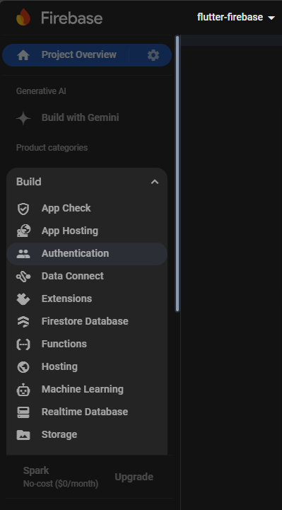
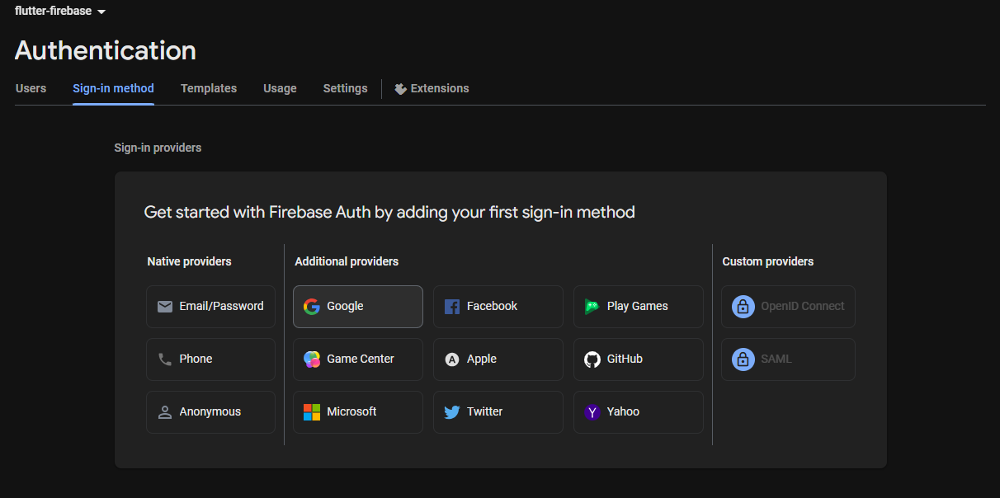
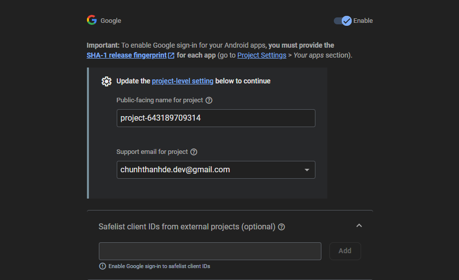
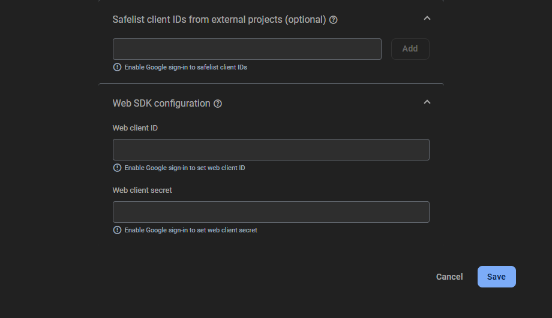
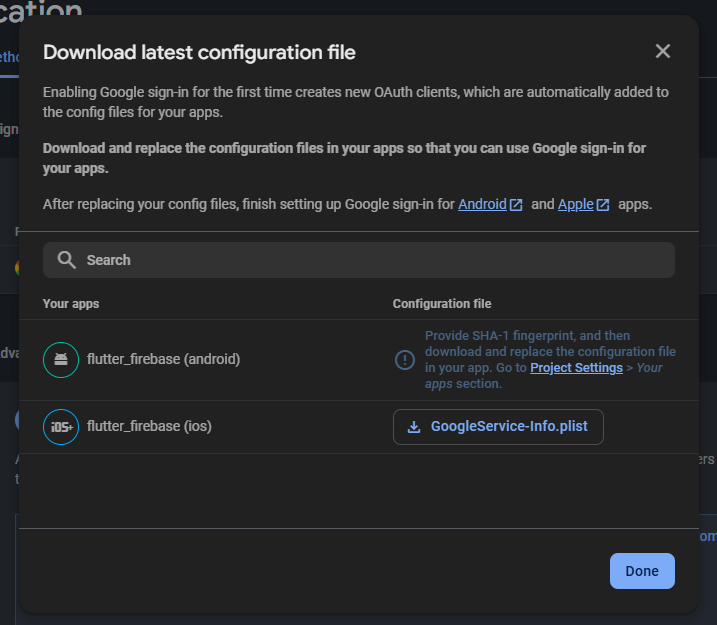
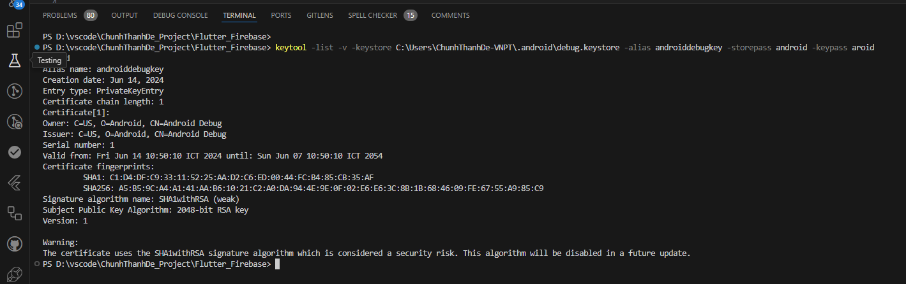
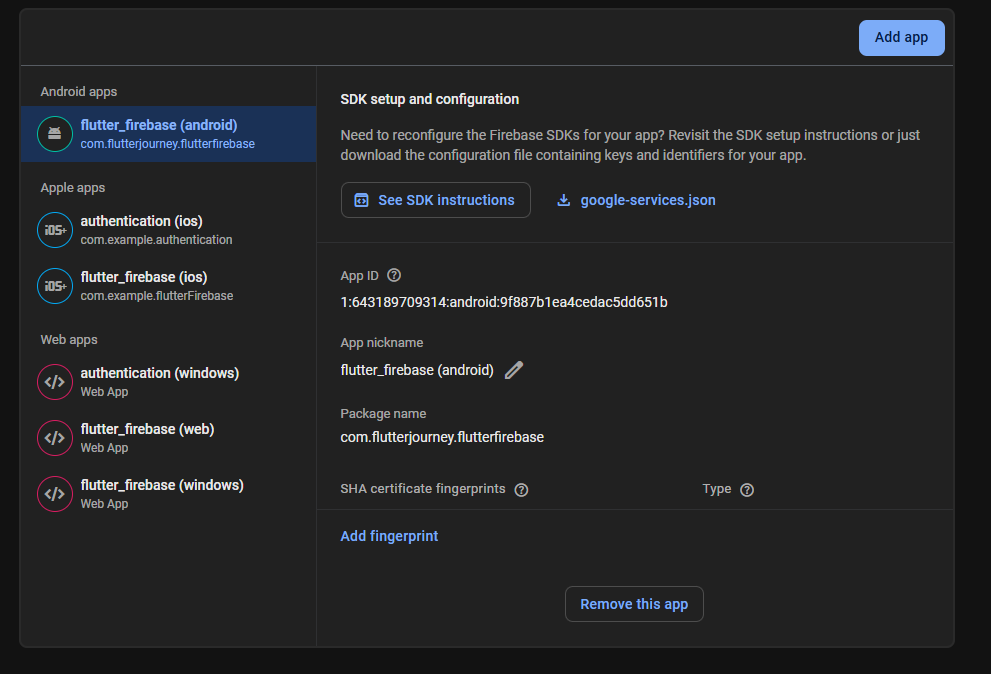
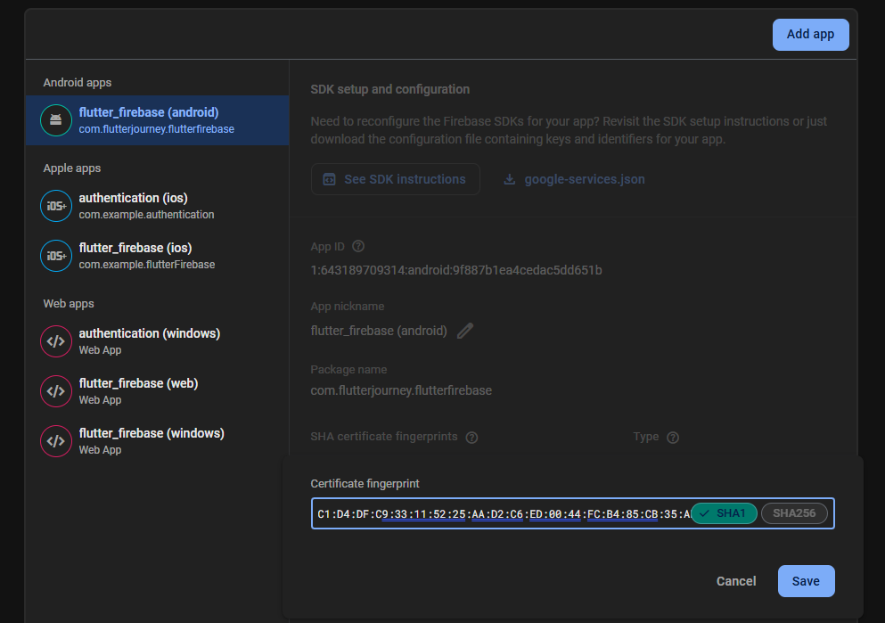
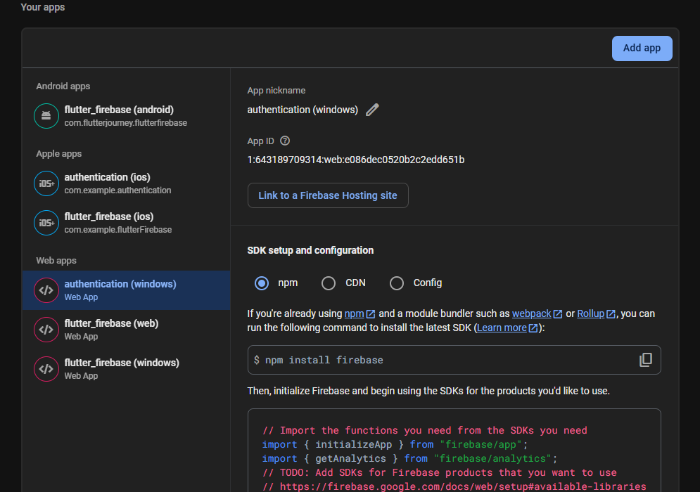

# Flutter Firebase Authentication Setup Guide

This guide will walk you through the steps to configure Firebase Authentication in your Flutter project.

## Step 1: Enable Firebase Authentication
1. Open the [Firebase Console](https://console.firebase.google.com/).
2. Select your project or create a new one.
3. In the Firebase Console, go to **Authentication** from the left-hand sidebar.
4. Click on the **Get Started** button.
5. Choose **Google** as a sign-in method and enable it.
6. Click **Save** to apply the changes.

Here are the two tables with images as requested:

### Table 1: Firebase Console Setup (Step 1)

| Step | Image |
|------|-------|
| 1. Go to Firebase Console and choose Authentication |  |
| 2. Click on "Get Started" to initialize the setup |  |

---

### Table 2: Google Authentication Configuration

| Step | Image |
|------|-------|
| 1. Enable Google Authentication in Firebase Console |  |
| 2. Enable it and save the settings |   |

## Step 2: Add Fingerprints for Android (Optional for Android apps)
If you're configuring Firebase for Android, you need to add the correct fingerprints for your app:

1. Open a terminal and run the following command to get your debug keystore fingerprint:

```bash
   keytool -list -v -keystore C:\Users\<your-username>\.android\debug.keystore -alias androiddebugkey -storepass android -keypass android
```

2. Go to **Project Settings** in the Firebase Console.

3. Add the fingerprints you obtained from the command above.

### Table 3: Add Fingerprints for Android

| Action | Screenshot |
|--------|-----------|
| Go to Project Settings |  |
| Obtain Fingerprints Using Command |  |
| Add Fingerprints in Firebase |     |


## Step 3: Add Firebase Configuration for Web (Optional for Web apps)

If you're working on a web app, you need to configure the Firebase settings in your web project:

1. Go to the Firebase Console and select your project.
2. In **Project Settings**, under the **General** tab, find your Firebase web configuration.
3. Follow the instructions to add the configuration to your `/web/index.html` file.

### Add Configure for Web



## Step 4: Run Flutterfire Configure

Once you’ve completed the setup in the Firebase Console, run the following command in your terminal to update your Flutter project with the latest Firebase configurations:

```bash
flutterfire configure
```

This will refresh your Flutter project to ensure the changes you made on the Firebase Console are reflected in your app.
